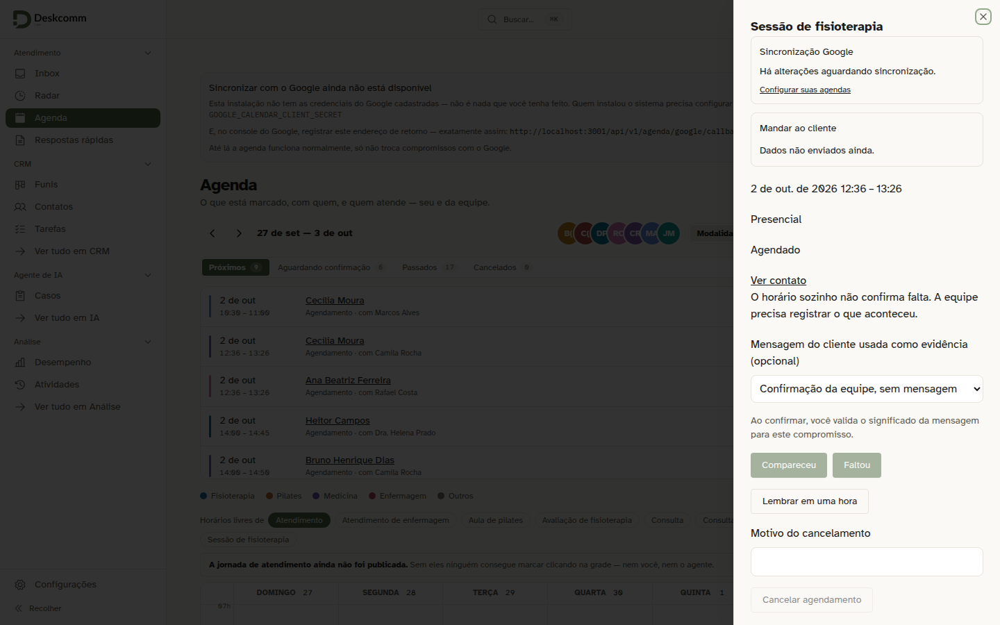
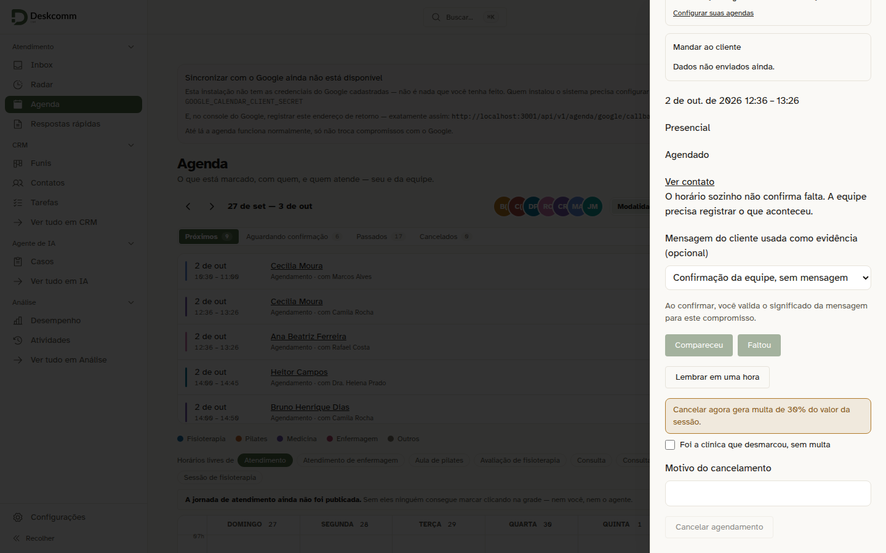
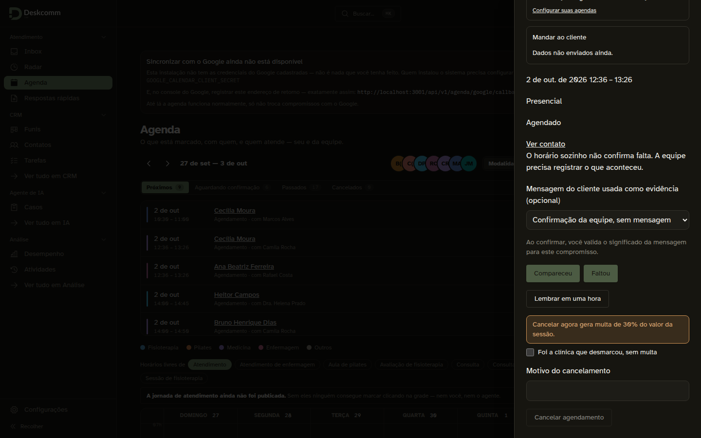
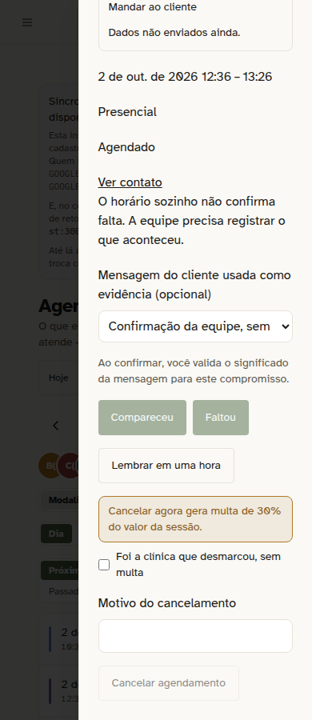
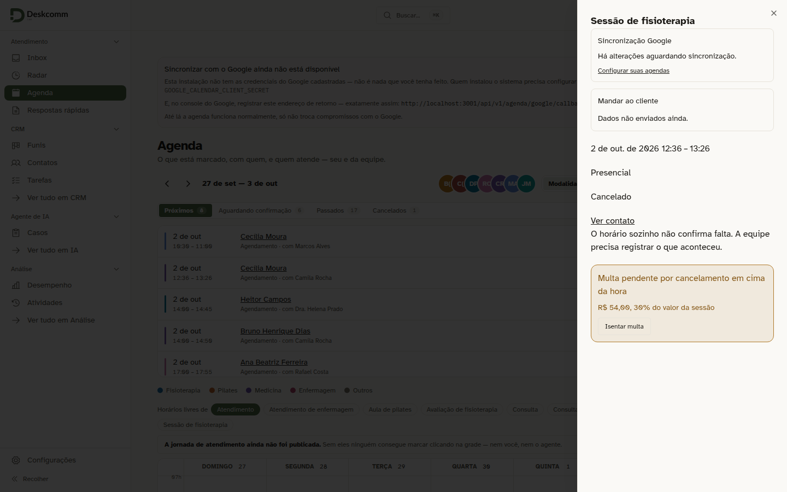
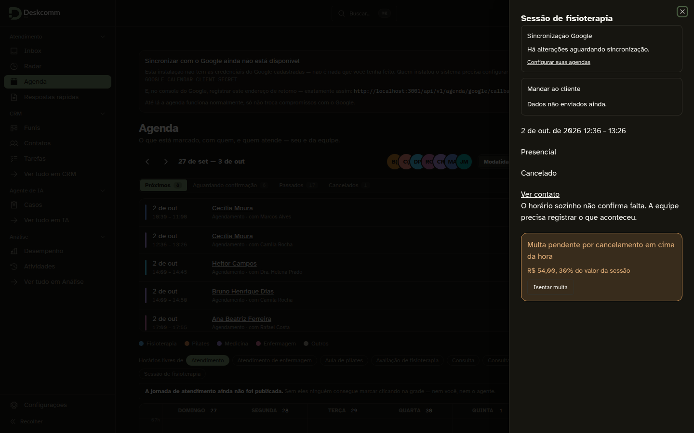
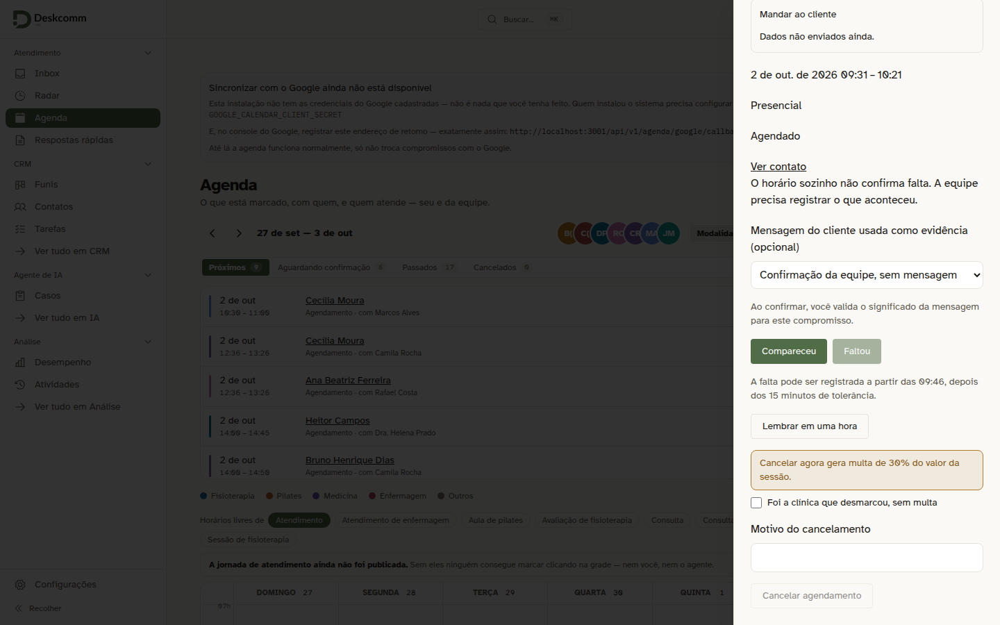
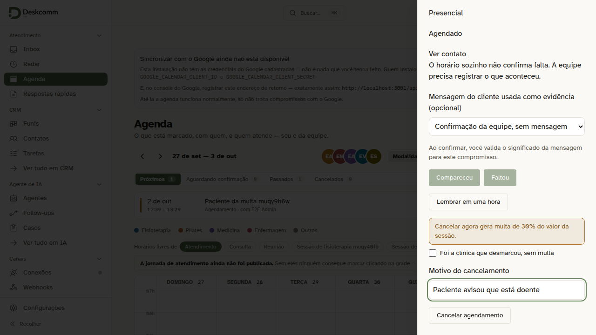
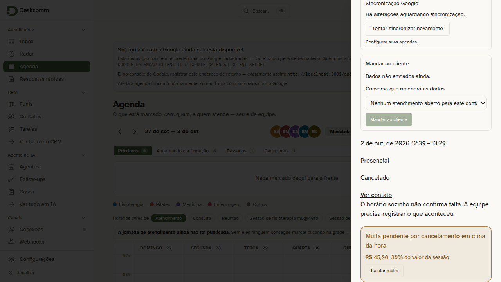
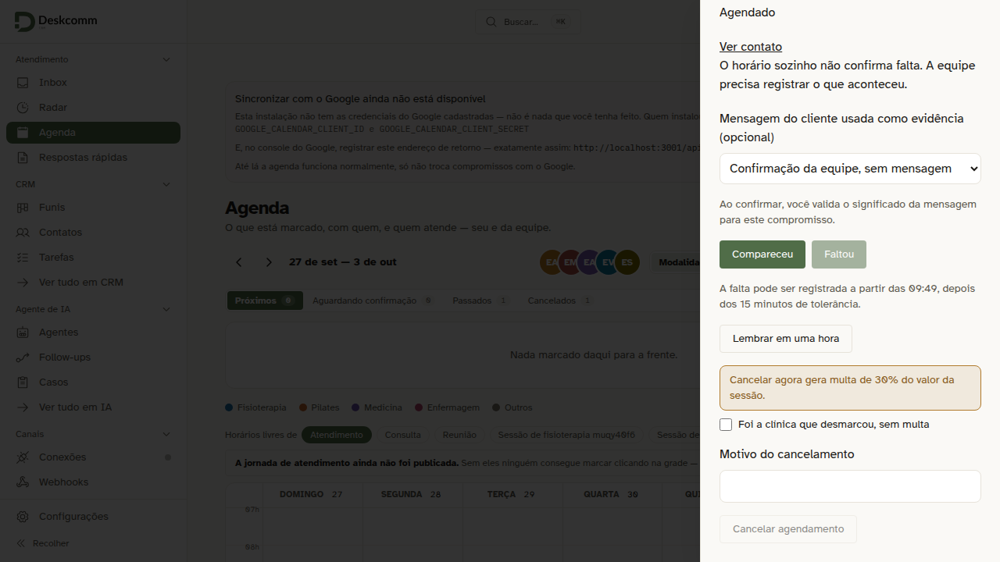

# Sessão da clínica no painel do compromisso: multa e tolerância

Provado pela tela com a recepção de uma clínica fictícia (login `recepcao@toq.demo`), módulo clínica instalado e os tipos de atendimento etiquetados com modalidade. O painel abre pela Agenda, pelo link `?compromisso=`.

| Captura | O que mostra |
|---|---|
|  | Antes: o painel do núcleo. Cancelar não avisava nada, e é assim que fica fora das sessões da clínica. |
|  | Sessão daqui a 3 horas: o aviso da multa de 30% vem antes do cancelamento, com a opção de dizer que foi a clínica que desmarcou. |
|  | O mesmo aviso no tema escuro. |
|  | O mesmo aviso no celular, com 390 px. |
|  | Depois de cancelar: a multa pendente, com o valor calculado do preço da sessão e o botão de isentar. |
|  | A multa no tema escuro. |
|  | Sessão que começou há 5 minutos: "Faltou" travado e a hora em que a falta pode ser registrada. |

Capturas da spec `tests/e2e/clinica-cancelar-com-multa.spec.ts`, que cancela, isenta e confere a trava da falta:

- 
- 
- 
