# Origem do paciente na ficha, no cadastro e no relatório

Provado pela tela com uma clínica fictícia: a recepção (`recepcao@toq.demo`, perfil Atendente) e a gerência (`gestao@toq.demo`, Administrador), módulo clínica instalado e a lista padrão de origens. Os pacientes, médicos, influenciadores e anúncios são inventados. A origem de Daniel e de Juliana foi registrada pela tela; a dos outros pacientes entrou direto no banco, para o relatório ter o que contar.

| Captura | O que mostra |
|---|---|
| 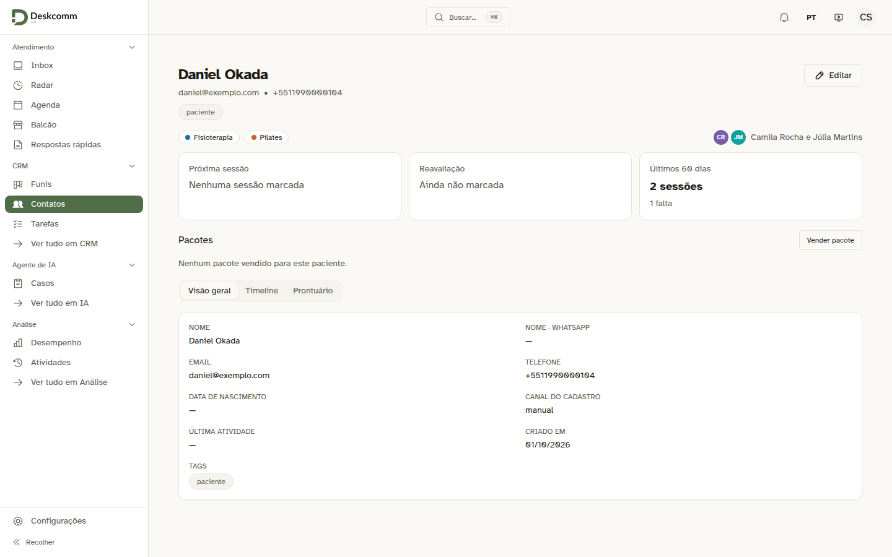 | Antes: a ficha sem nada sobre a origem do paciente. É a mesma tela com a linha nova retirada, que é o que a versão atual desenha. |
| 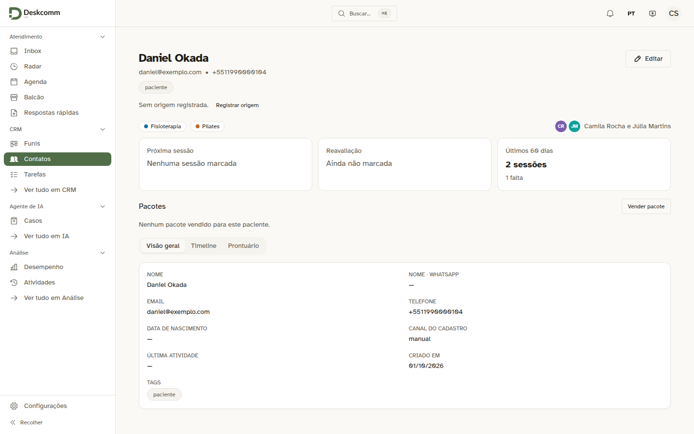 | Depois, paciente sem origem: "Sem origem registrada." e o botão "Registrar origem". |
| 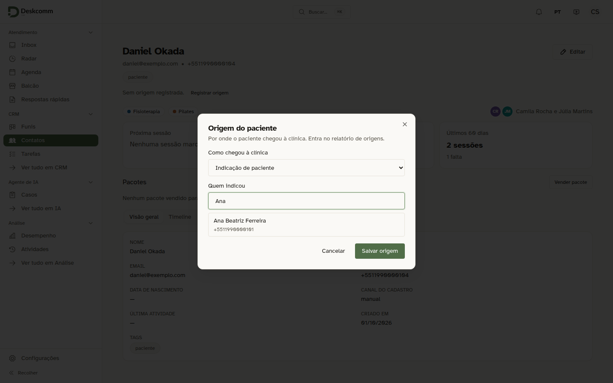 | Indicação de paciente: a janela pede quem indicou e busca na lista de contatos. |
| 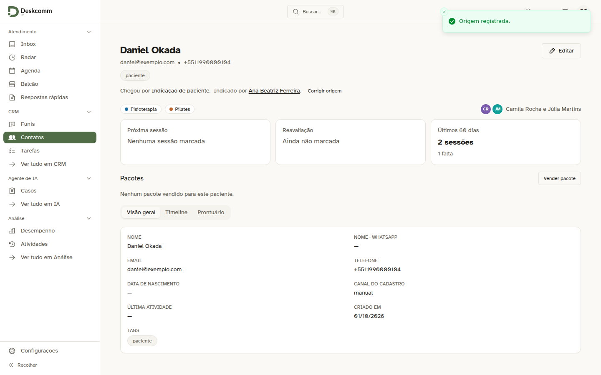 | A ficha depois de salvar: "Chegou por Indicação de paciente. Indicado por Ana Beatriz Ferreira.", com o link para a ficha dela. |
| 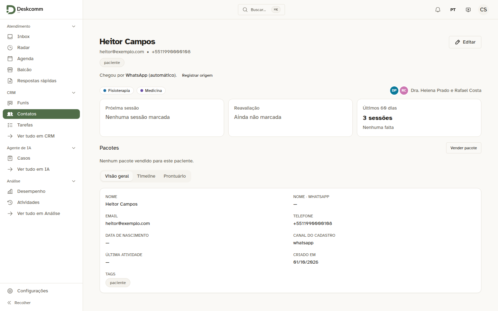 | Quem chegou sozinho pelo WhatsApp aparece como "WhatsApp (automático)", e a recepção pode registrar outra. |
| 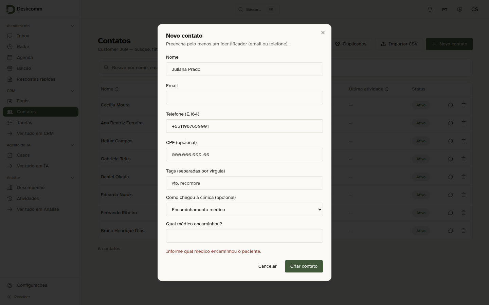 | "Novo contato" com encaminhamento médico e sem o médico: a tela pede o nome antes de criar. |
| 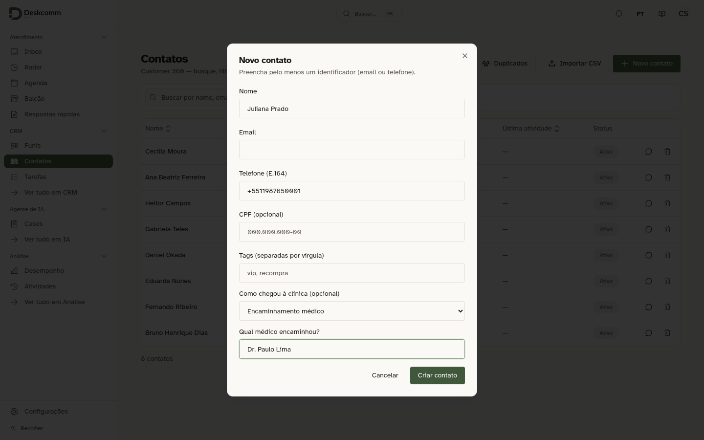 | O mesmo cadastro com o médico preenchido. O aviso some quando a origem muda. |
| 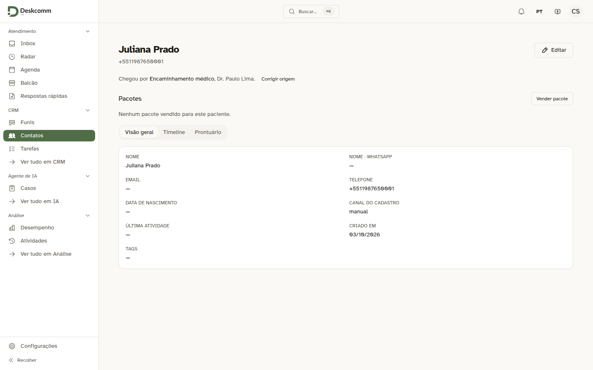 | A ficha do paciente recém-criado: "Chegou por Encaminhamento médico, Dr. Paulo Lima." |
| 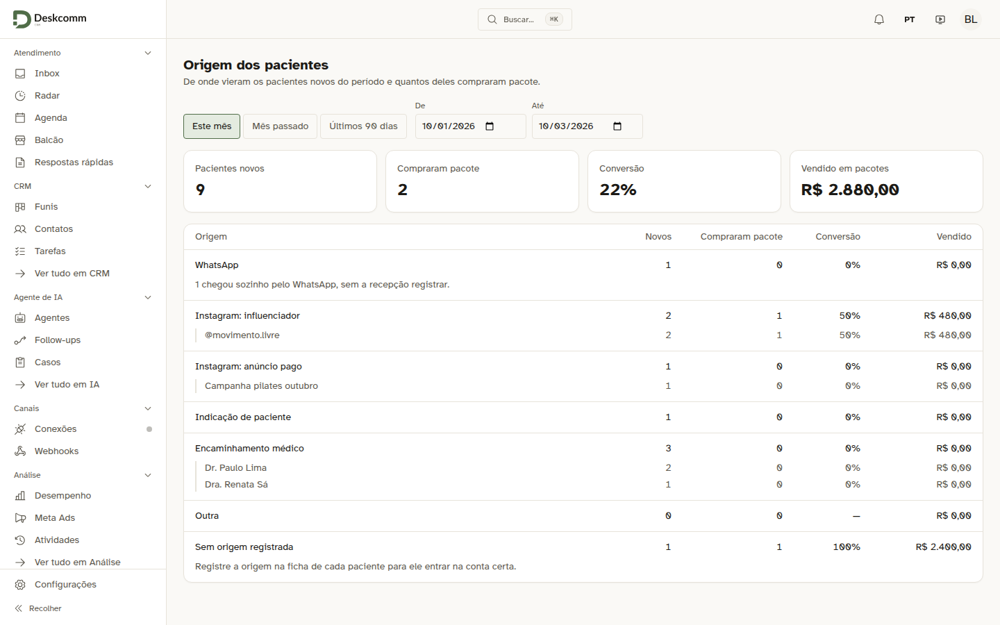 | O relatório do mês para a gerência: o total, cada origem com os novos, quantos compraram pacote, a conversão e o valor, e por baixo cada médico, influenciador ou anúncio. |
| 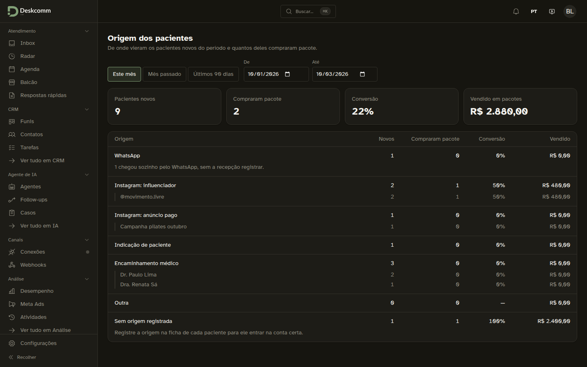 | O mesmo relatório no tema escuro. |
| 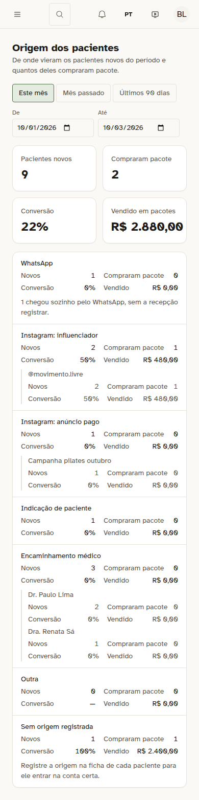 | O relatório no celular, com 390 px e sem rolagem para o lado: cada número leva o próprio rótulo. |
| 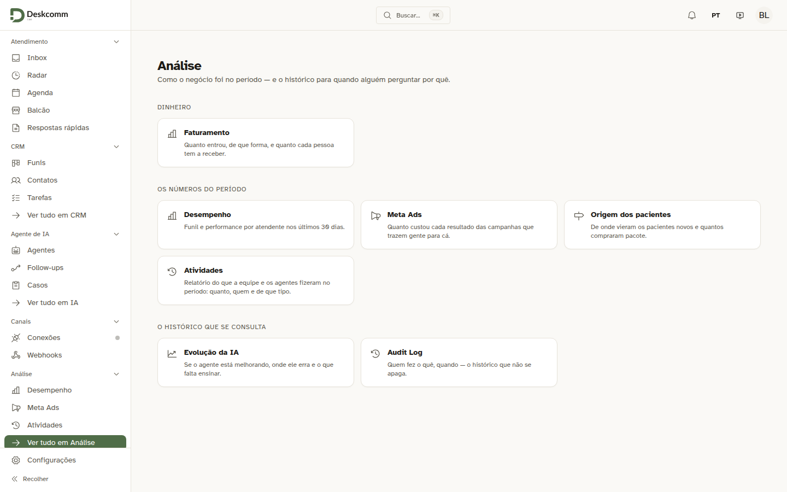 | A porta "Origem dos pacientes" em Análise, para a gerência. A recepção que digita o endereço vai para a página de acesso negado. |

Capturas da spec `tests/e2e/clinica-origem-na-tela.spec.ts`, que registra a indicação pela ficha, cria um contato encaminhado pelo "Novo contato", lê o médico no relatório pela gerência e confere que o perfil Somente leitura vê a origem sem poder mudar:

- 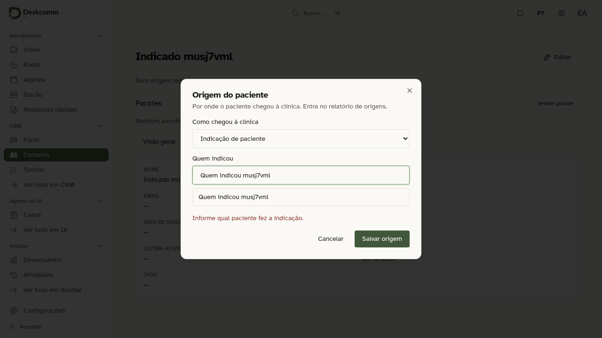
- 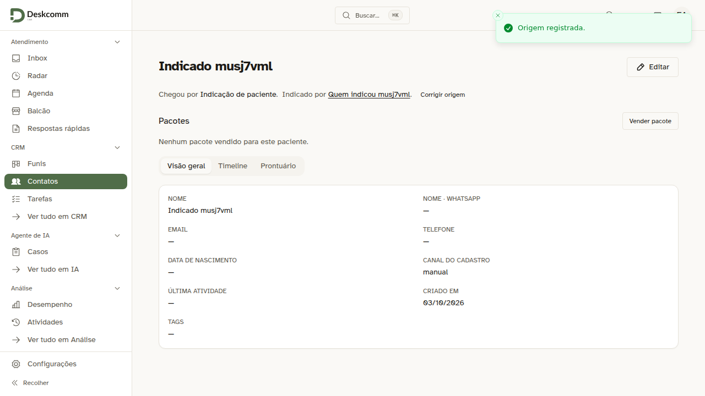
- 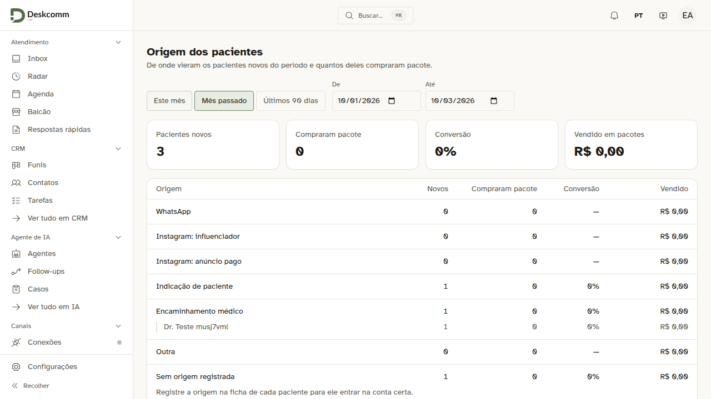
