# Pacotes de sessões na ficha do paciente

Provado pela tela com uma clínica fictícia: a recepção (`recepcao@toq.demo`, perfil Atendente) e a gerência (`gestao@toq.demo`, Administrador), módulo clínica instalado e dois pacotes no catálogo, inventados para o teste ("Fisioterapia 10 sessões" por R$ 1.200,00 e "Pilates 8 aulas" por R$ 480,00). As sessões gastas entraram direto no banco; no uso real quem as lança é a agenda, com "Compareceu" e "Faltou".

| Captura | O que mostra |
|---|---|
| 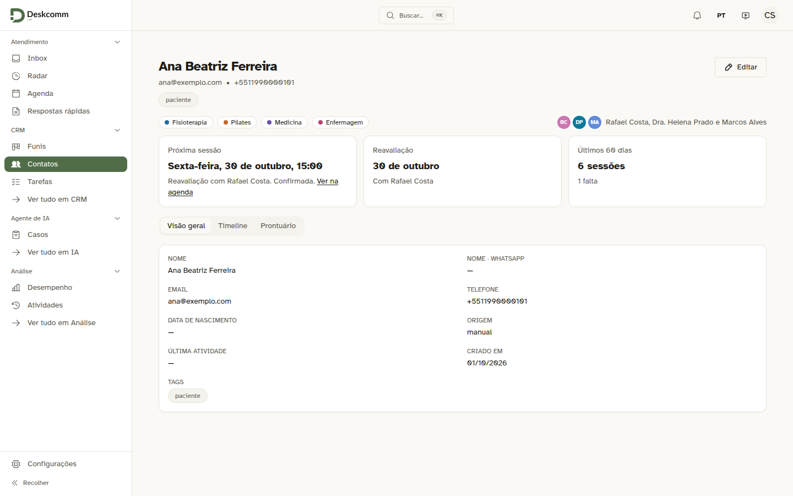 | Antes: a ficha com o resumo da clínica e nada sobre pacotes. É a mesma tela com o bloco novo retirado, que é o que a versão atual desenha. |
| 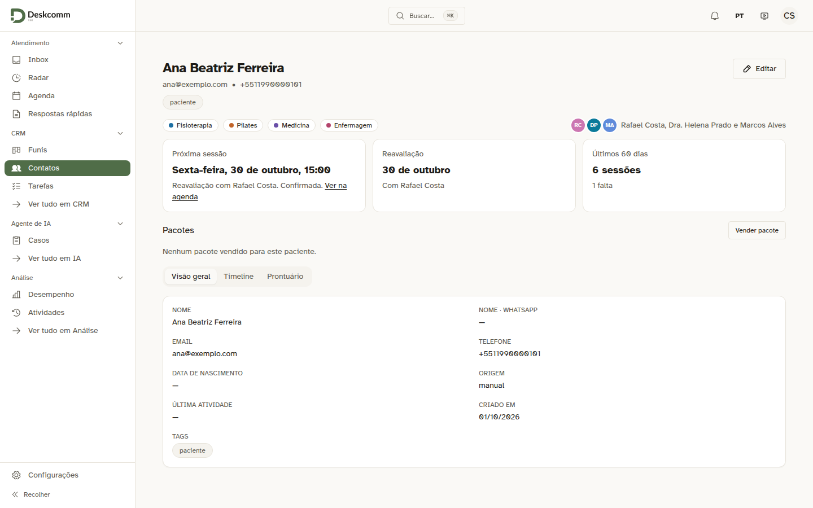 | Depois, paciente sem pacote: o bloco "Pacotes" com o botão "Vender pacote". |
| 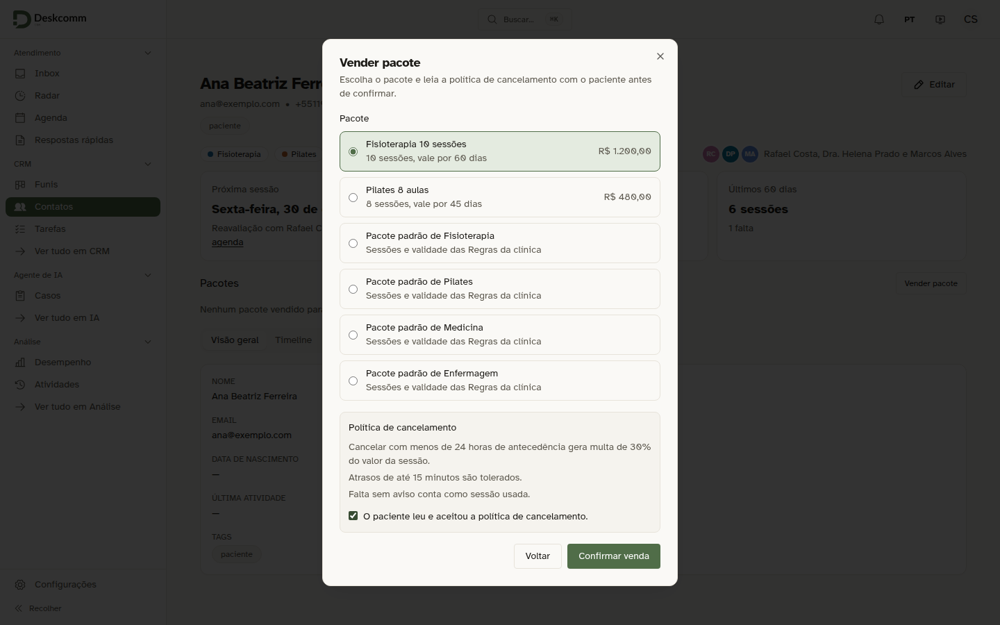 | A venda: o catálogo, o pacote padrão de cada modalidade (funciona antes de a clínica definir os preços) e a política de cancelamento em vigor. "Confirmar venda" só libera com o aceite marcado. |
| 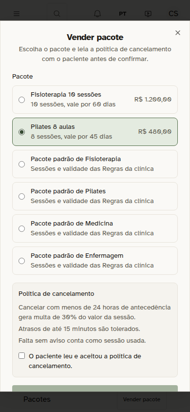 | A janela de venda no celular, com 390 px. |
| 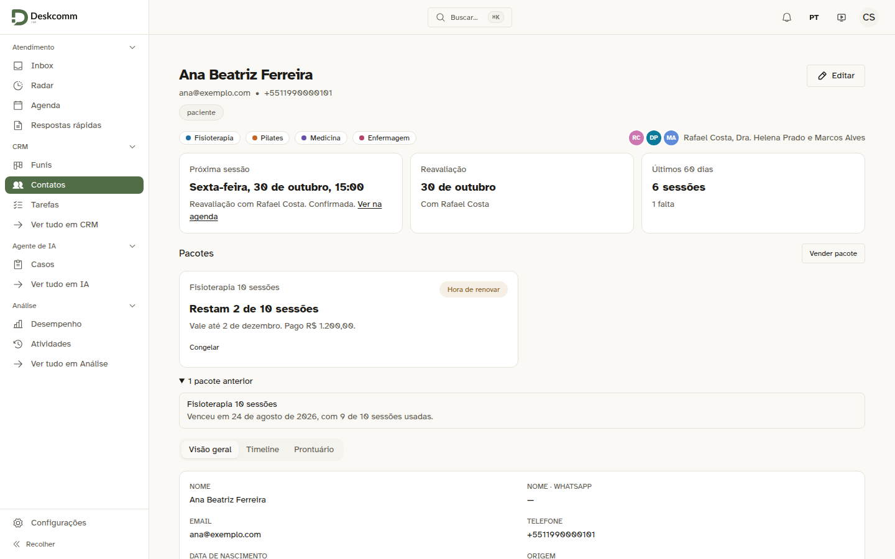 | Oito sessões gastas: "Restam 2 de 10 sessões", a validade, o valor pago e o aviso "Hora de renovar". A recepção só vê "Congelar". O pacote vencido fica recolhido embaixo. |
| 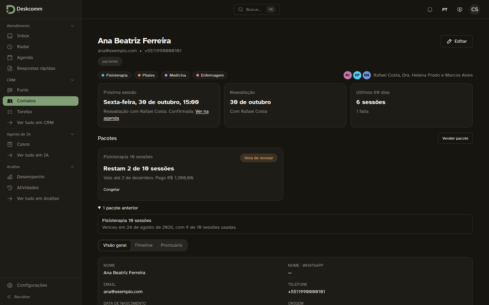 | O mesmo bloco no tema escuro. |
| 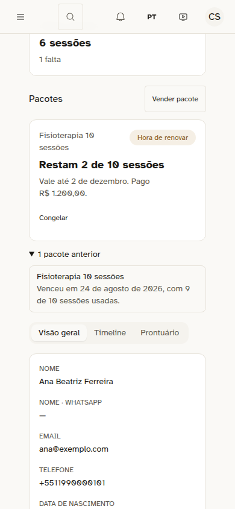 | O mesmo bloco no celular. |
| 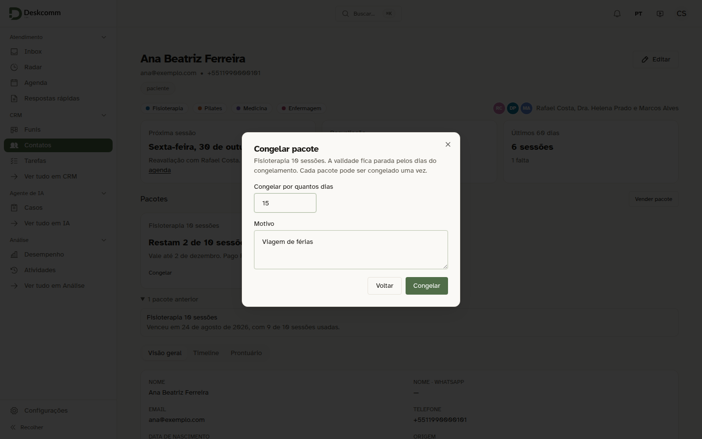 | Congelar: dias e motivo. Cada pacote congela uma vez. |
| 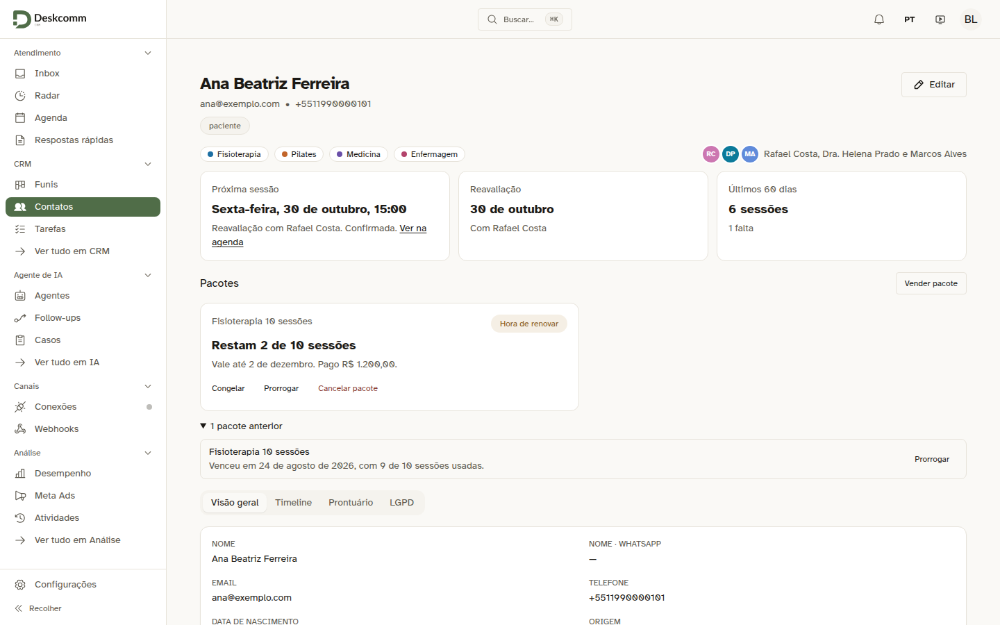 | A gerência vê também "Prorrogar" e "Cancelar pacote". No pacote vencido, só "Prorrogar". |
| 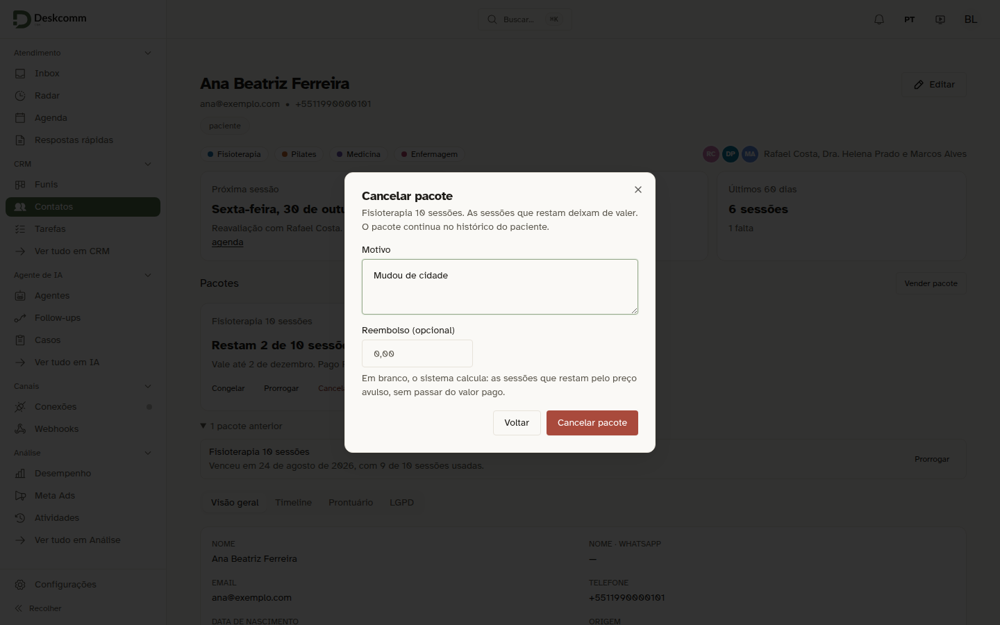 | Cancelar: motivo e reembolso opcional; em branco, o sistema calcula. |

Capturas da spec `tests/e2e/clinica-pacotes-na-ficha.spec.ts`, que vende pela gerência, congela, prorroga e cancela, vende de novo pela recepção e confere que o perfil Somente leitura não vê o bloco:

- 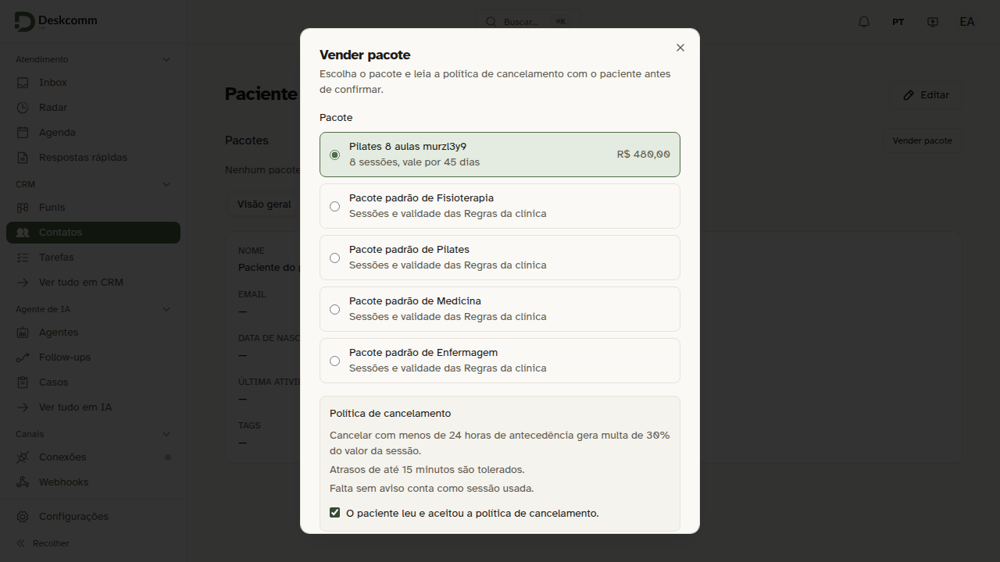
- 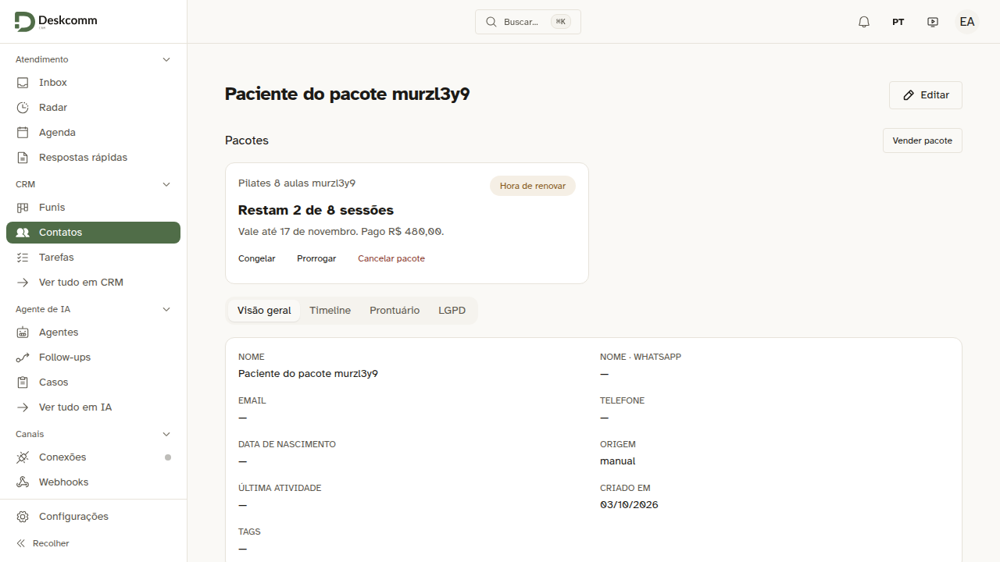
- 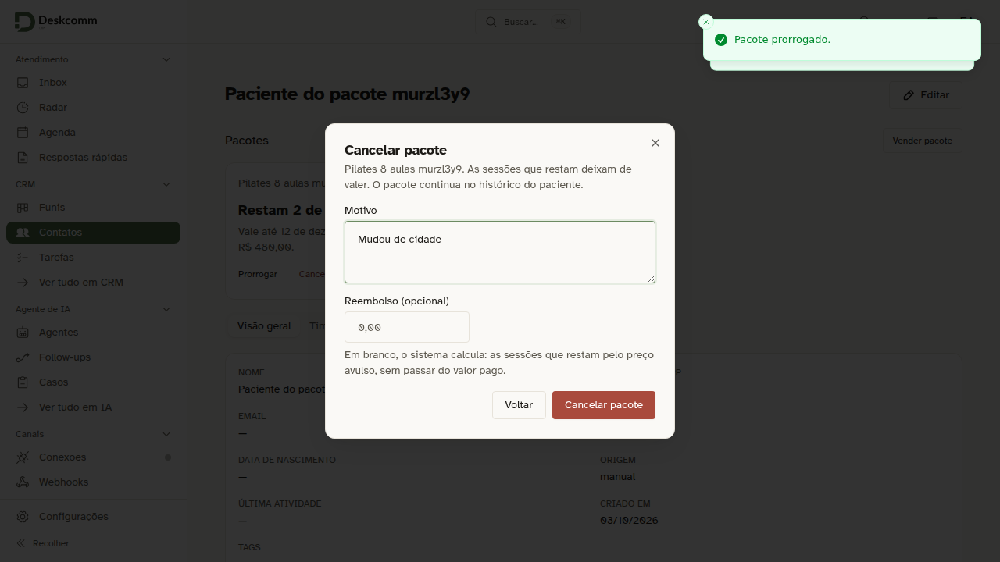
- 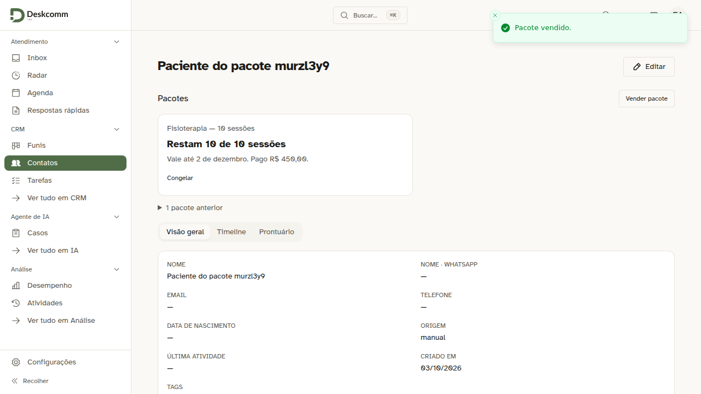
