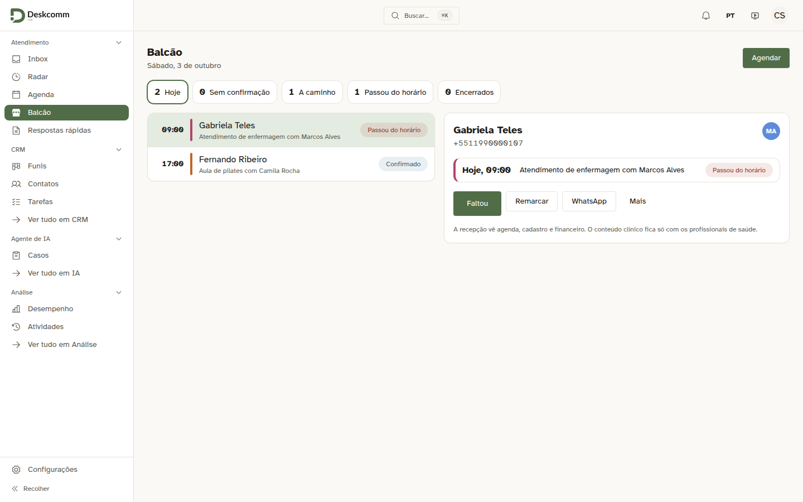
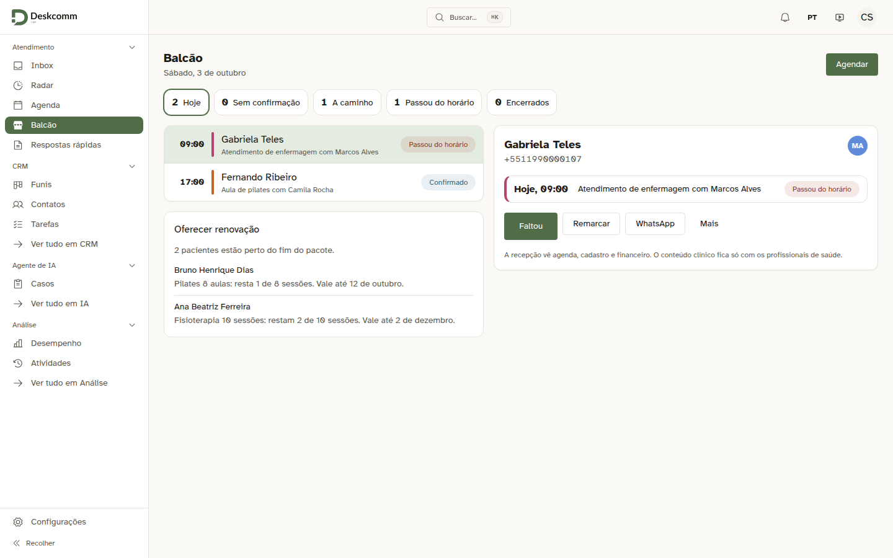
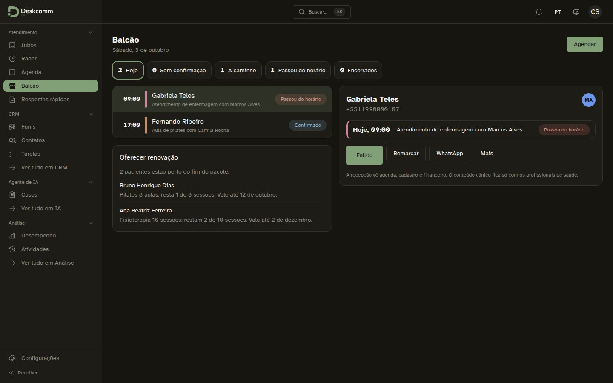
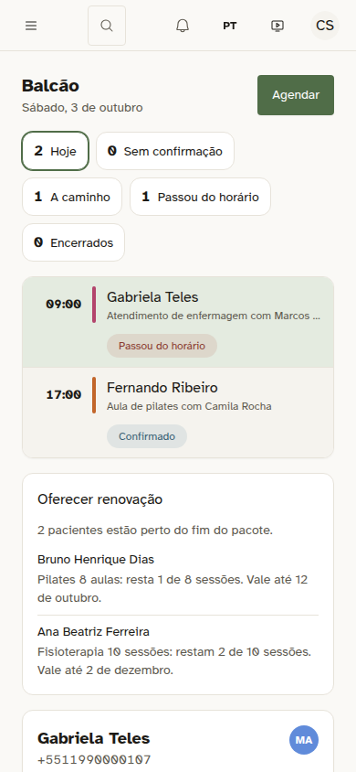
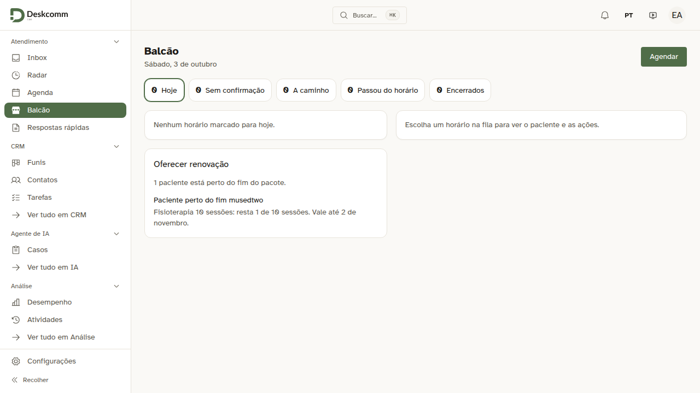

# Oferecer renovação no Balcão da recepção

Provado pela tela com a recepção de uma clínica fictícia (`recepcao@toq.demo`, perfil Atendente), módulo clínica instalado. Os pacotes e as sessões gastas são inventados e entraram direto no banco.

| Captura | O que mostra |
|---|---|
|  | Antes: o Balcão com a fila do dia e o paciente escolhido, sem nada sobre pacotes. É a mesma tela com o bloco novo retirado, que é o que a versão atual desenha. |
|  | Depois: embaixo da fila, "Oferecer renovação" lista quem está perto do fim do pacote, os que vencem antes primeiro. Cada linha abre a ficha do paciente, onde fica o "Vender pacote". |
|  | O mesmo no tema escuro. |
|  | O mesmo no celular, com 390 px. |

Captura da spec `tests/e2e/clinica-pacotes-renovar.spec.ts`, que confere que o pacote com 1 sessão entra na lista, o com 7 não entra, e que a linha leva à ficha com "Hora de renovar":

- 
