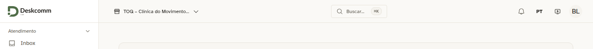
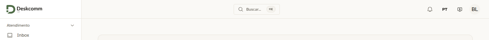
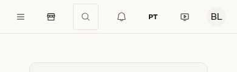
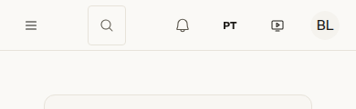

# Uma clínica, uma organização: o seletor de organização sai do topo

Provado pela tela com o login de gestão de uma clínica fictícia (`gestao@toq.demo`). Ele é administrador da instalação e participa de uma organização só, com o módulo clínica instalado e a equipe de saúde cadastrada.

| Captura | O que mostra |
|---|---|
|  | Antes: o seletor "TOQ – Clínica do Movimento" no topo, com um item só e o "Gerenciar organizações". Capturado com a equipe de saúde desligada por um instante, que reproduz o comportamento do núcleo. |
|  | Depois: com a equipe ativa, o topo fica só com a busca, o sino, o idioma e o menu do usuário. |
|  | Antes, no celular (390 px): o ícone do seletor ao lado do menu. |
|  | Depois, no celular. |

O roteiro é o mesmo nas quatro capturas: entrar, abrir a Agenda e conferir se `tenant-switcher` está visível (antes: visível; depois: ausente).
